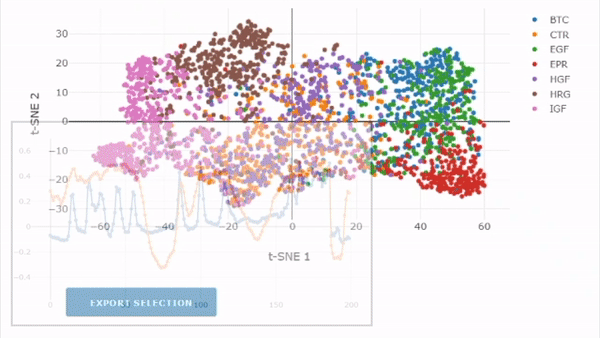

# CODEX: COnvolutional neural networks for Dynamic EXploration

   * [What is CODEX?](#what-is-codex)
   * [What analysis are available in CODEX?](#what-analysis-are-available-in-codex)
   * [How to cite us?](#how-to-cite-us)
   * [Getting started](#getting-started)
      * [Installation](#installation)
         * [Singularity container](#singularity-container)
         * [Python part](#python-part)
         * [R part (recommended, only used for the motif mining analysis)](#r-part-recommended-only-used-for-the-motif-mining-analysis)
      * [Input format and requirements](#input-format-and-requirements)
         * [The core zip archive](#the-core-zip-archive)
         * [Missing values and trajectories length](#missing-values-and-trajectories-length)
         * [Preprocessing](#preprocessing)
      * [Proposed CNN architecture and adding new architectures](#proposed-cnn-architecture-and-adding-new-architectures)
      * [Multivariate input](#multivariate-input)
      * [Sample data and models](#sample-data-and-models)
   * [Interactive app for CNN features projection and inspection](#interactive-app-for-cnn-features-projection-and-inspection)

# What is CODEX?
CODEX is an approach for time-series data exploration that relies on Convolutional Neural Networks (CNNs). It is most useful for identifying signature dynamics in sets of heterogeneous trajectories. It was originally developed for the study of single-cell signaling data but can be applied to any time-series data.

CODEX relies on the training of a supervised classifier to separate input classes based on input trajectories. In the context of cell biology, the classes usually correspond to experimental conditions, or other groups of interest, for which one wishes to reveal signatures in dynamic cell states. CODEX revolves around the observation that the data-driven features created by the CNNs are shaped around dynamic motifs and trends in the datasets. With the information contained in these features, we obtain an overview of the dynamics relative to each class by the means of different techniques. The final outputs of CODEX comprise: a low-dimensional embedding to visualize the dataset dynamic trends at a glance, a set of representative prototype trajectories for each class, and a collection of discriminative motifs for each class.



# What analysis are available in CODEX?
There are currently 3 main analysis performed in CODEX:
* The projection of the trajectories CNN features in a low-dimensional space. This visualization provides an overview of all dynamics trends in the dataset and enables the identification of subpopulations at a glance. Use the companion app for interactive browsing of this projection.
* The identification of representative prototype trajectories for each class. Several types of prototypes are extracted, some favorize the trajectories that are extremely specific for each class, others favorize a more complete coverage of all major trajectories trends in the class. Check Notebook 2.
* The mining of signature motifs for each class. This relies on the use of Class Activation Maps (CAMs), a method that maps to each point in the series a quantitative value that reflects the importance of the points to recognize a given class ([Zhou et al. 2015](https://arxiv.org/pdf/1512.04150.pdf)). These motifs are clustered to obtain a tidy overview of Check Notebooks 3 and 4.

# How to cite us?

If you use CODEX for your  work, please cite the following paper:
```
Jacques, Marc‐Antoine, et al. "CODEX, a neural network approach to explore signaling dynamics landscapes." Molecular Systems Biology 17.4 (2021): e10026.
```
This publication is available in open access at:
https://www.embopress.org/doi/full/10.15252/msb.202010026

# Getting started

If it is the first time you use CODEX, we recommend to use the notebooks to run all analysis. They contain detailed information about each approach and their parameters. We provide two sample datasets along with already trained models for both. Once you grew familiar with the workflow, you probably will find the command line calls more flexible. (Note: At the moment, command-line callable scripts are only available for the training and the companion visualization app; prototype analysis and pattern mining scripts are coming soon.).

Also, bear in mind that training a CNN in reasonable time requires a dedicated GPU. A CPU-only system will be fine for inference (*i.e.* run CODEX's analysis with an already trained model), but training will be orders of magnitude slower. A consumer-grade, mid-range GPU (*e.g.* Nvidia GTX 1050) is sufficient for most applications.

## Installation

CODEX is written in Python and uses the powerful [Pytorch](https://pytorch.org/) and [Pytorch-lightning](https://www.pytorchlightning.ai/) libraries for artificial neural networks. In addition, some helper scripts for the motifs mining analysis are written in R. CODEX was tested on Ubuntu 16, Ubuntu 18, Ubuntu 20 and Windows 10.

### Singularity container

Rather than installing the environment, you might prefer using a Singularity container for ease-of-use and better reproducibility. You can download a [ready CPU-only image over here on figshare](https://figshare.com/articles/software/CODEX_singularity_container_-_CPU_only/24156330).
Alternatively, if you wish to rebuild the image yourself, its definition file can be found under `CONDA/singularity_CODEX_CPUonly.def`.

To run the CODEX analysis with this container, simply execute the scripts through the image like so:
  ```
  singularity exec path/to/singularity/image.sif python source/train_model.py --data sample_data/GrowthFactor_ErkAkt_Bivariate.zip --nepochs 10 -b 50 --ngpu 0 
  ```

### Python part

0. Prerequisites: Clone this repository and make sure that you have a recent version of [Anaconda](https://www.anaconda.com) (Python 3 required, Python 2 not supported; tested with Python 3.7 and 3.8).
1. From there, you have 2 options to install CODEX's Conda environment depending on your system:
    1. For Windows and Linux users. If you have a compatible GPU and CUDA 10 or CUDA 11 installed, the easiest way is to install the Conda environment with the .yml file provided in this repo. To do so, in command line (or Anaconda prompt on Windows) navigate to the location of the repository and type:
    ```
    # For CUDA 10 or CUDA 11, Windows and Linux only
    conda env create -f CONDA/CONDA_ENV_CUDA11-1.yml
    ```  
    2. For OSX users or if you do not have a compatible GPU or if you have CUDA 9, create the Conda environment manually. To do so, follow the instructions in `CONDA/CONDA_ENVmanual.txt`.

That's it! You should be all set. Don't forget to activate CODEX's Conda environment every time you want to use CODEX. To start Jupyter's notebook server in your freshly installed Conda environment, go to Anaconda prompt and enter:
```
conda activate codex
jupyter notebook
```

You can also start to train CNNs without Jupyter's notebooks by directly calling the training script. Here is a minimal example which works for univariate and bivariate inputs:
```
python source/train_model.py --data path/to/data/file --nepochs 10 --ngpu 1
```

Many more options are available to control the CNN inputs, training hyperparameters, handle imbalanced datasets... You can access them with `python source/train_model.py --help`. In addition, all parameters of [Pytorch Lightning's Trainer object](https://pytorch-lightning.readthedocs.io/en/stable/common/trainer.html#trainer-flags) can be passed to the script.

### R part (recommended, only used for the motif mining analysis)

Follow this next section if you want to use Notebook 3 for clustering CAM-based motifs.

A couple of R scripts are used to compute Dynamic Time Warping (DTW) distance and cluster class-specific motifs. These operations are run after the actual extraction of the motifs and are here to help tidying the results for interpretation. This step is optional but recommended. Alternatively, you can write your own pipeline to compute the distance matrix and cluster the motifs from the exported file that contains the motifs.

0. Prerequisites: Have a working [R](https://www.r-project.org/) installation (> 3.5; tested with R 3.5,3.6 and 4.0).
1. Install the following R packages: `argparse, data.table, proxy, dtw, parallelDist, reshape2, ggplot2, stringr, dendextend`
2. You will need to manually change the first line in both R scripts: `dtw_multivar_distmat.R` and `pattern_clustering.R`. On this line, in both files, change the variable `user_lib` such that it contains the path that points to the directory where your personal R packages are installed. For example in Windows, this path should look like: `'C:/Users/myUserName/Documents/R/win-library/X.X'` where X.X is the version of R; in Linux, this path should look like: `'/home/myUserName/R/x86_64-pc-linux-gnu-library/X.X'`.

## Input format and requirements

### The core zip archive
CODEX includes a class of objects, `DataProcesser`, to consistently import input data. This class expects a .zip archive which contains at least the 3 following files:
* dataset.csv: this is the file that contains the time-series. The data are organized in wide format (series on rows, measurements on columns). It must contain 2 columns: ID and class (the column names are flexible but these names will be automatically recognized without further input from the user). The ID should be unique to each series. The classes should be dummy-coded with integer (e.g. if you have 3 classes named A, B and C, this should be encoded as 0, 1, or 2 in this column). The rest of the columns should contain the actual measurements. The column names must follow a precise convention. They are of the form XXX_YYY, where XXX represent the measurement name and YYY the time of measurement (e.g. ERK_12, means ERK value at time point 12). Shall you have multivariate series, just append new columns while respecting the naming convention. For example, for a dataset of 3 time points where you follow both ERK and AKT in single cells the column names should be: ID, class, ERK_1, ERK_2, ERK_3, AKT_1, AKT_2, AKT_3.
* classes.csv: this file holds the correspondence between the dummy-coded classes and their actual names. It is a small file with 2 columns: class and class_name. The former holds the same dummy-coded variables as in dataset.csv; while the second holds the human-readable version of it. Once again please try to stick to these default names so you do not have to pass them at every DataProcesser call.
* id_set.csv: this file contains the split of data between train/validation/test. It has 2 columns: ID and set. The IDs must be identical to the ones in dataset.csv. The set value must be one of "train", "validation" or "test". Data are typically randomly split in 50-70% to the training set, 20-30% to the validation set and 10-20% to the test set.

Check the sample dataset for an example of a formatted zip archive.

### Missing values and trajectories length
CODEX can handle trajectories of varying lengths. Missing values (NAs) are permitted in the series, provided that they are located at the extremeties of the series. For example:
* `[NA, 0, 0, 1]` or `[0, 0, 1, NA, NA, NA]` or `[NA, 0, 0, 1, NA, NA, NA]` are all valid series because their central segment is uninterrupted.
* `[NA, 0, 0, NA, 1]` or `[NA, 0, 0, NA, 1, NA, NA, NA]` are not valid. You can consider interpolating the central NAs.

Nevertheless, the CNN architecture used in CODEX requires the input trajectories to be of fixed length, which is provided when creating the model. This means that the longest possible input length is the length of the shortest central segment across all series. A common preprocessing step in CODEX is to randomly crop the series to a slightly shorter length than the minimal one. This is a data augmentation technique, like creating several series from a single one, which helps to prevent overfitting when training the model. You do not have to perform this cropping when formatting the data, it is done on the fly as they are passed to the network. If you do not want to allow this wobbling (e.g. for reproducibility), fix the set by hand before or use the fixed cropping preprocessing step. For multivariate input, both channels will be cut to the same length.

### Preprocessing
A common question before starting this analysis is: do I need to preprocess my data? The answer will depend on what you are looking for. Keep in mind that the CNN is a classifier that is trained to separate the classes. In general, anything that you do not want the model to be able to use as a basis to separate the classes should be removed by preprocessing. For example, imagine you perform measurements for 2 different groups but know that, for some reason, there is a strong offset between the 2 groups that is not of interest for you, you probably be better with subtracting trajectories baselines.

There are 2 ways to preprocess the data:
* Either it is done directly in the dataset.csv file in the zip archive.
* Or it is done on-the-fly when data are passed to the CNN. This is mostly used for data augmentation technique. This is performed using [Pytorch's Dataset and Transforms](https://pytorch.org/tutorials/beginner/data_loading_tutorial.html).

A typical preprocessing workflow performed on the fly comprises, check the Notebooks for a concrete example:
* A random crop of the trajectories to the length imposed by the model.
* The removal of the average value, in the training set, from each channel. This is a common preprocessing operation for CNNs.

## Bundled CNN architecture and adding new architectures
In CODEX we propose to use a plain, convolutional architecture that was previously described as a solid baseline for a range of time-series datasets ([Zhou et al. 2015](https://arxiv.org/pdf/1512.04150.pdf); [Wang and Yan 2016](https://arxiv.org/pdf/1611.06455.pdf)). This architecture comprises a cascade of convolution layers, followed by ReLU and batch normalization. After this cascade, the responses to the convolutions are averaged with global average pooling (GAP) which forms a 1D vector representation of the input. We refer to the latter vector as CNN features. It is these features that are then used for classification (with a subsequent fully-conencted layer) and projected for visualization in a low-dimensional space. The model architecture for univariate inputs is defined in the class `LitConvNetCam`; for bivariate inputs, it is defined in the class `LitConvNetCamBi`. New architectures can be added in `models.py`, for example to handle inputs with more than 2 dimensions.

## Multivariate input
CODEX can handle multivariate input. See the corresponding sections for formatting the data. We provide 2 models, one for the univariate case and one for the bivariate case, but the input could theoretically be of any dimension. Just be sure to include a new model in the models.py file.
In the proposed CNN architecture, the multivariate input time-series are treated like images with a single color channel (2D plane). Further, we chose to run the 2D convolutions with kernel sizes such that the convolution operation spans over all channels a once. In the CAM-based motif mining, different regions can be highlighted on both channels. However in the current implementation, the motifs are defined as "rectangles", which are defined by a start and an end time point and spans across all channels on this exact segment.

## Sample data and models
Under `sample_data/` you will find 2 sample datasets to help you get started with CODEX. These files can be used as templates to create the input data .zip archive.
* `Synthetic_Univariate.zip` contains a large, univariate synthetic dataset with 2 classes. Each trajectory was built to contain 4 peak events that can be either a full Gaussian peak or a half-truncated Gaussian peak. Peaks are triggered at random locations but with a minimal distance from each other. The class labeled Full displays predominantly full peaks (2, 3 or 4), while the class labeled Truncated displays predominantly truncated Gaussian peaks (0, 1 or 2 full peaks). The side of the Gaussian peak that is being truncated is chosen at random. Such data can be created with the script `source/synthetic_data.py`. The synthetic variable is named FRST (first, as in "first acquisition channel").
* `GrowthFactor_ErkAkt_Bivariate.zip` contains a real-world dataset. It represents the activity over time of 2 [signaling pathways](https://en.wikipedia.org/wiki/Signal_transduction) in single-cells: [ERK](https://en.wikipedia.org/wiki/MAPK/ERK_pathway) and [Akt](https://en.wikipedia.org/wiki/PI3K/AKT/mTOR_pathway). Cells were stimulated with one out of 6 [growth factors](https://en.wikipedia.org/wiki/Growth_factor) ([BTC](https://en.wikipedia.org/wiki/Betacellulin), [EGF](https://en.wikipedia.org/wiki/Epidermal_growth_factor), [EPR](https://en.wikipedia.org/wiki/Epiregulin), [HGF](https://en.wikipedia.org/wiki/Hepatocyte_growth_factor), [HRG](https://en.wikipedia.org/wiki/Neuregulin_1), [IGF](https://en.wikipedia.org/wiki/Insulin-like_growth_factor)) or left starved (CTR, control). The treatment applied to a given cell defines the class of the trajectory.

For each dataset, an already trained model is provided under `Notebooks/models/`. If you try to train your own model for the cell signaling dataset, be aware that the resulting model will likely display poor performance. This is because the sample dataset is a subset of a much larger dataset.


# Interactive app for CNN features projection and inspection
A companion app is also included in this repo to help with the projection and visualization of the CNN features. This projection is of great help to reveal structures in the dataset that are usually associated with dynamics motifs. The app runs in a web browser and enables to visualize the trajectories associated to each point in the projection, locate classes prototypes, as well as to create CAMs towards any classes.

To run the app, in the command line (or the Anaconda prompt, with the codex environment activated) navigate to `source_app/` and enter:
```
python app_tsne.py -d path/to/data/file -m path/to/model/file
```
Copy the address in the script output and open it in your favorite web browser (the address should look like: http://127.0.0.1:XXX). You should immediatly see the interface of the app and, after the t-SNE coordinates are computed (you can follow this in the prompt), the plot area will be populated with the projection. Replace `path/to/model/file` and `path/to/data/file` by the paths to the data zip archive that you want to visualize and the model that you want to use to create the features that will be projected.

 More options for the app can be found by typing:
```
python app_tsne.py --help
```

The projection algorithm is t-SNE, you can set the most important parameters of the projection directly in the app. Note that on boot, the t-SNE will be calculated with the minimal number of iterations (250). This will likely result in a bad projection where all points are collapsed in a single cloud. Put this value to a few thousands, say 2500, and press the button "run tSNE". We found a learning rate value of 600 to be a reasonable guess for most cases. The perplexity parameters controls the trade-off between global and local trends that the t-SNE projection will capture. A low value puts emphasis on local trends while a high value puts emphasis on global trends. If you see small, disconnected clusters appearing, you should probably increase the perplexity. Try out a few perplexity values to see if any structure in the projection appears and check that it is not an artefact by looking for it in different projections. A rule of thumb is to set the perplexity value to the expected number of neighbors around each point. You can find more tips on the [sklearn tSNE help page](https://scikit-learn.org/stable/modules/generated/sklearn.manifold.TSNE.html).

The buttons on top of the plots let you zoom, pane and reset axes. The rectangle tool and lasso tools let your select trajectories that you can then export in a .csv table with the button in the bottom-left corner. Multiple selection is possible, just press Shift while selecting. This is useful to reproduce the plot outside the app. The export table is customizable and can also contain the model prediction, the features of each selected trajectory, preprocessing informations...

Calculating tSNE can take some time for large datasets. To avoid recomputing this everytime you want to browse the projection, you can load precomputed tSNE coordinates. The app is then just used as an interactive browser of the projection. CAMs and prototypes can also be visualized in this mode. To activate this mode, tick the box in the top banner. Note that in the current implementation, you still need to provide a valid model file to use this mode.

In case you randomly crop the series to fixed length segments before passing them to the model (to fit the model dimensions), you have 2 options to visualize the cropped segments (*i.e.* the trajectories that were actually passed as input to the model and not the entire uncropped trajectory). In the top-right corner, check `Show borders of network input`, this will indicate with red dashed lines the limits of the segment that was passed to the model. Also in the top-right corner, check `Center x-axis on network input` to zoom on the segment that was passed to the model.


# References

Jacques, Marc‐Antoine, et al. "CODEX, a neural network approach to explore signaling dynamics landscapes." Molecular Systems Biology 17.4 (2021): e10026.

Wang, Z., Yan, W., & Oates, T. (2017, May). Time series classification from scratch with deep neural networks: A strong baseline. In 2017 International joint conference on neural networks (IJCNN) (pp. 1578-1585). IEEE.

Zhou, B., Khosla, A., Lapedriza, A., Oliva, A., & Torralba, A. (2016). Learning deep features for discriminative localization. In Proceedings of the IEEE conference on computer vision and pattern recognition (pp. 2921-2929).
